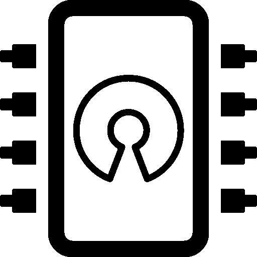
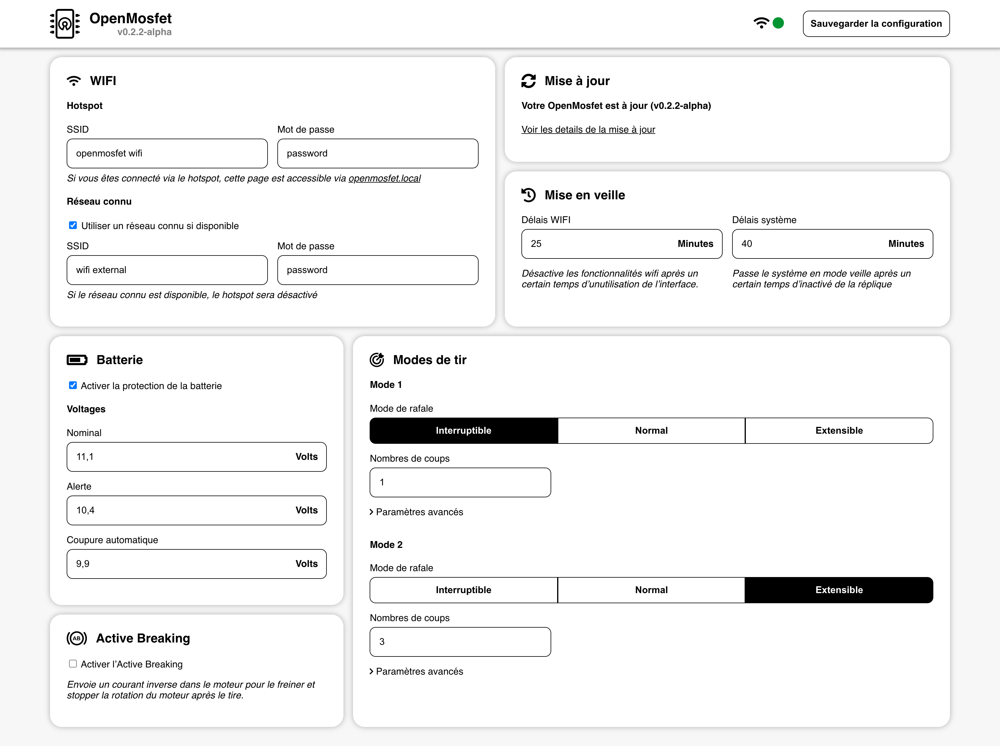

 

  

  <h3 align="center">OpenMosfet</h3>

  

    An high quality open source <strong>airsoft mosfet</strong>  based on arduino.
      
    <a href="#"><strong>Explore the docs »</strong></a>
     
     
    <a href="https://github.com/simonjamain/openmosfet/issues">Report Bug</a>
    ·
    <a href="https://github.com/simonjamain/openmosfet/issues">Request Feature</a>
  

  
Table of Contents

  <ol>
    <li>
      <a href="#about-the-project">About The Project</a>
      <ul>
        <li>
          <a href="#the-team">The team</a>
        </li>
      </ul>
    </li>
    <li>
      <a href="#getting-started">Getting Started</a>
      <ul>
        <li><a href="#installation-and-build">Installation and build</a></li>
        <li><a href="#replica-interface-types">Replica interface types</a></li>
        <li><a href="#custom-replica-interface-pinout">Custom replica interface pinout</a></li>
      </ul>
    </li>
    <li>
      <a href="#development">Development</a>
      <ul>
        <li>
          <a href="#local-ui-without-board">Local UI (without board)</a>
          <ul>
            <li><a href="#install-and-serve">Install and serve</a></li>
          </ul>
        </li>
      </ul>
    </li>
    <li><a href="#usage">Development</a></li>
    <li><a href="#roadmap">Roadmap</a></li>
    <li><a href="#contributing">Contributing</a></li>
    <li><a href="#todo">To-Do</a></li>
  </ol>

## About the project

OpenMosfet is an high quality open source airsoft mosfet based on arduino (currently esp32 board).

The software is meant to be modular and to allow different sensors configurations.

The hardware provides all the electronics needed and allows different boards to be created.

The web dashboard allows full and easy controls over every settings as well an update manager.

### The team

The team is composed of two developers and two electronitians, all french airsofters.

- 👨🏻‍💻 [Simon](https://github.com/simonjamain)
- 👨🏽‍💻 [Zao Soula](https://github.com/zaosoula)
- 👨🏻‍🔧 [Romain](https://github.com/rboutrois)
- 👨‍🔧 [Marcellin](https://github.com/simonjamain)
- **Feel free to [contribute](#contributing) to the project**

## Getting started
### Installation and build
- Install platformio
- "open" the project
- it is recommended that you create your custom platformio environements in a `custom_env.ini` (you can copy `custom_env.example.ini` file).
  This way you can assign different pins or use different boards types without messing with the git versionning and you can still inherit from envs defined in the `platformio.ini` file.
  - *Note : don't forget to include the parent build flags if you inherhit an env*
- for building the ui (mandatory) :
  - install node.js
  - inside the `ui` folder, run `npm install`
  - *Note : `ui.h` is recompiled by running the command `npm run build` inside the `ui` folder. this is done automaticaly before each platformio build (see [UI Development](#ui-development) section, platformio.ini and build_ui.py)*
- *Note :* OTA upload is enabled by default, if your board hasn't ota enabled or you want to upload with serial, you can :
  - QUICK AND DIRTY WAY : comment that following parameters in `platformio.ini`
    - `upload_protocol`
    - `upload_port`
  - PROPER WAY
    - use `custom_env.ini` and create an environement with redifined `upload_protocol` and `upload_port` (see `custom_env.example.ini`), ex :
      - upload_protocol = esptool
      - upload_port = *
- default password for access point is "password"
- I think thats about it...

## UI Development

### Local UI (without board)
To serve the UI locally on your computer, we provide a fake server to simulate the board behavior.

#### Install and serve
  - inside the `/src/ui/` folder, run `npm install`
  - run `npm run serve-dev`
  - open http://localhost:3000/ in your browser
  - you can now edit ``src/`` without having to re-launch the server

*Note: The configuration is loaded from ``defaultConf.json`` and can be updated as long as the server is running.
Once it stops the updated configuration is lost*

### Replica interface types
Depending on your replica and the way you connect the mosfet, the signals received are not the same.

ex : the original input plate on the G&G TR 16 can be used but the signals are very specific.
- You only know if the safety is disengaged (and mag not empty) when you get a signal from the trigger
- You only know if selector is on full auto or not before firing

You have to choose which behavior you want by specify the value of the `REPLICA_TYPE` preprocessor flag (see platformio.ini).

Here is a table (work in progress) listing the different configuration available :

`REPLICA_TYPE` value | pins behavior | examples
---------------------|---------------|--------------
1 | `OM_DEFAULT_FIRINGGROUP_PIN` grounded when : trigger is pressed `OM_DEFAULT_CYCLE_PIN` grounded when cutoff is pressed `OM_DEFAULT_SELECTOR_PIN` grounded when selector is on full auto position | G&G tr16 original input plate
2 | `OM_DEFAULT_FIRINGGROUP_PIN` grounded when : trigger is pressed `OM_DEFAULT_CYCLE_PIN` grounded when when tappet plate is forwad (nozzle pressed against bucking) `OM_DEFAULT_SELECTOR_PIN` cycle through firemodes and safety on falling edge | custom input plate with microswitch detecting tappet plate, simple press button as a selector
3 | `OM_DEFAULT_FIRINGGROUP_PIN` grounded when : trigger is pressed `OM_DEFAULT_CYCLE_PIN` grounded when cutoff is pressed `OM_DEFAULT_SELECTOR_PIN` between 0v and vcc depending on selector position (needs calibration)

### Custom replica interface pinout
For developpement reasons or other, you can change the default settings for the replica interface with the following flags :

- `OM_DEFAULT_MOTOR_PIN`
- `OM_DEFAULT_FIRINGGROUP_PIN`
- `OM_DEFAULT_CYCLE_PIN`
- `OM_DEFAULT_SELECTOR_PIN`

*Note: it is not recommended that you change this value in the source file, but rather as a build flag in platformio.ini for example.*  
*Note: for example, the ESP32DEVKIT V1 doesnt have the pin 10 exposed, which is the default pin used on the board for the selector input.*

### http rest-like API

Got to the [API documentation](/doc/api).

## Contributing
Don't hesitate to contact us via github, or your can come and talk with us on our [discord server](https://discord.gg/XuzSSbgE).

We are french but we can chat in english without problems.
